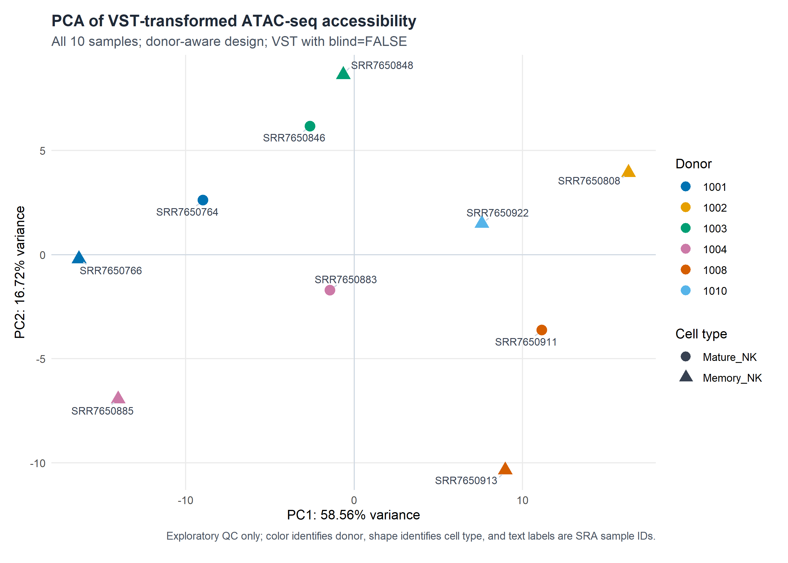
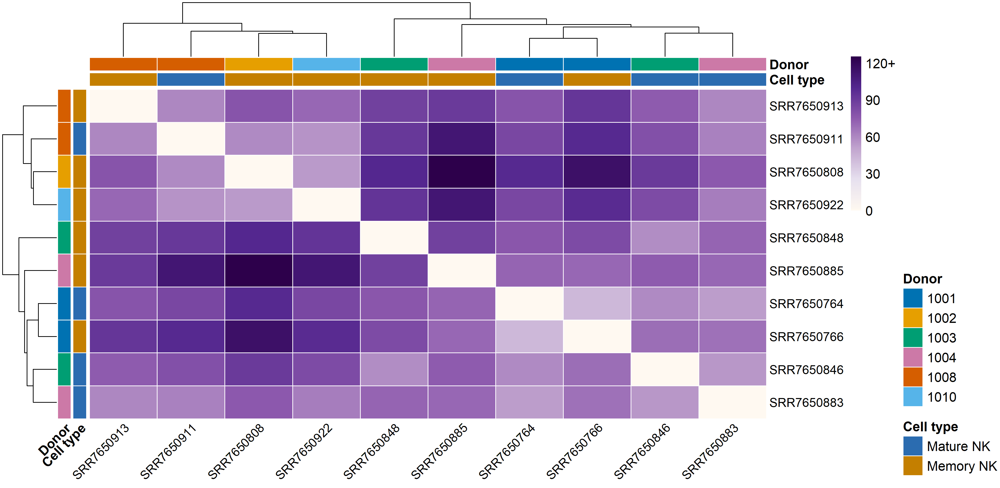
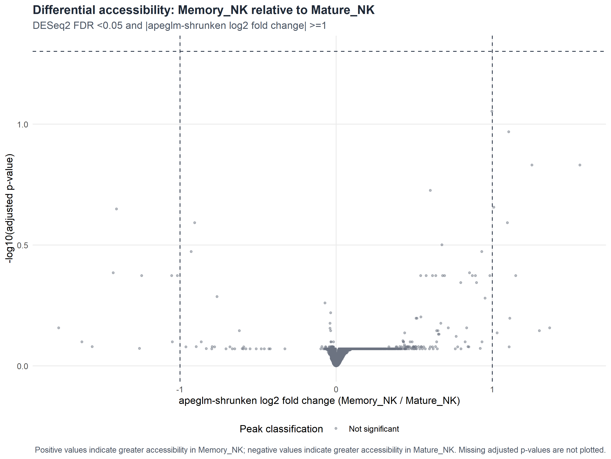
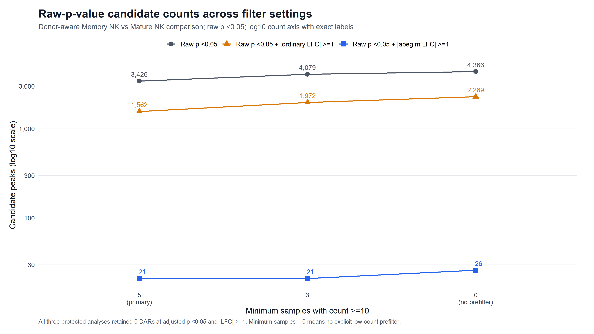
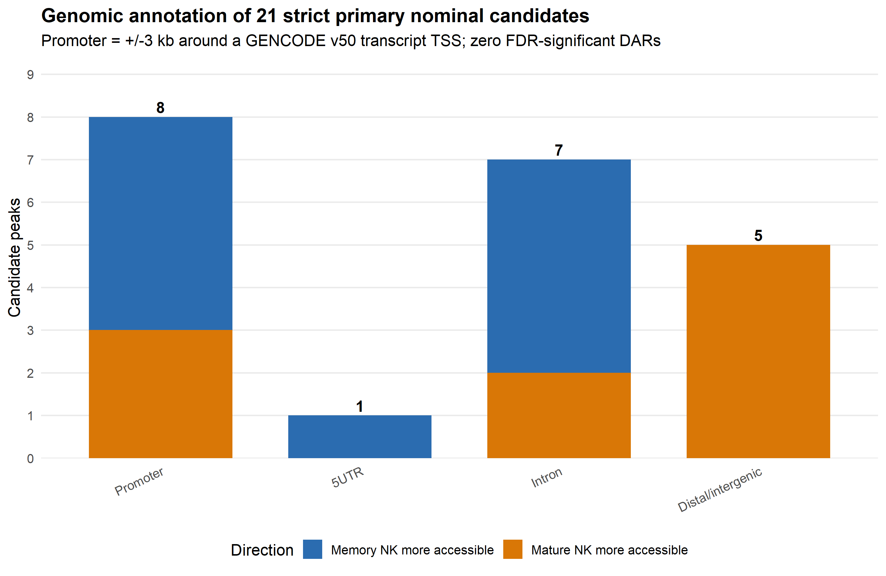

# Bulk ATAC-seq analysis of Mature and Memory human NK cells

[](https://github.com/yazalj/bulk-atacseq-mature-memory-nk/actions/workflows/validate.yml)
[](https://yazalj.github.io/bulk-atacseq-mature-memory-nk/)

This repository is a curated, public-facing snapshot of a three-week educational
bulk ATAC-seq project. It documents a donor-aware comparison of chromatin
accessibility between Mature and Memory human natural killer (NK) cells using
public sequencing accessions from Calderon et al. (2019).

## Project context

This work was completed during the three-week full-time internship component of
the **M.CoBi.310 Systems Biology** course at the University of Göttingen, in
collaboration with the University Medical Center Göttingen (UMG).

This repository is an independent, student-authored public release for
educational and portfolio use. It is not an official University of Göttingen or
UMG software product, publication, or institutional endorsement.

> **Primary result:** 59,186 consensus regions passed the prespecified
> low-count filter. No region met the declared differential-accessibility
> threshold of adjusted p-value < 0.05 and absolute log2 fold change >= 1,
> using either ordinary or apeglm-shrunken effect estimates.

Nominal raw-p-value candidates, nearest-gene annotations, enrichment results,
motif results, and IGV views are retained only as exploratory hypothesis-
generation material. They are not FDR-significant discoveries and do not
establish transcription-factor activity, regulatory targeting, or mechanism.

## Start here

- **Browse the project as a searchable website:** open the
  [documentation site](https://yazalj.github.io/bulk-atacseq-mature-memory-nk/)
  for sidebar navigation, search, and copy buttons on command blocks.
- **Reproduce or inspect this internship case study:** read the
  [reproducibility notes](docs/REPRODUCIBILITY.md) and the stage-specific
  documentation in the [`workflow/` guide](workflow/README.md).
- **Apply the same general approach to a new experiment:** follow the
  [step-by-step bulk ATAC-seq tutorial](docs/tutorial/README.md), beginning with
  the [beginner-friendly installation and setup guide](docs/tutorial/01_requirements_and_project_setup.md)
  and [quick-start checklist](docs/tutorial/QUICKSTART.md).
- **Work with an AI agent:** begin with the
  [human-supervised agent interface](agent/README.md). It provides a staged
  workflow contract, machine-readable configuration and status files,
  deterministic validation, and a repo-scoped Codex skill named
  `$bulk-atacseq-agent`.

The tutorial covers conventional **bulk, paired-end ATAC-seq**. It is not a
single-cell ATAC-seq workflow, and its example commands must be adapted to the
organism, reference build, library design, sample structure, and computing
environment of each study.

## Skills demonstrated

| Area | Methods and tools |
|---|---|
| Experimental design | Paired donors, replicate structure, covariate-aware modeling, prespecified contrasts |
| Bulk ATAC-seq | FastQC, Cutadapt, Bowtie2, SAMtools, Picard, MACS3, featureCounts |
| Statistical analysis | R, DESeq2, apeglm shrinkage, multiple-testing control, sensitivity analysis |
| Exploratory interpretation | GENCODE annotation, g:Profiler, HOMER, IGV, cautious non-causal reporting |
| Reproducibility | Bash, Python, validation tests, checksums, provenance records, non-overwriting outputs |
| AI-assisted analysis | Human-approval gates, machine-readable schemas, durable status, deterministic validation |

## Study design

| Item | Value |
|---|---|
| Assay | Bulk ATAC-seq |
| Comparison | Memory NK relative to Mature NK |
| Samples | 10 public SRA runs |
| Donors | 6 |
| Cell-type composition | 4 Mature NK; 6 Memory NK |
| Complete donor pairs | 4 |
| Memory-only donors | 2 |
| Consensus regions | 112,759 |
| Primary filter | Count >= 10 in at least 5 of 10 samples |
| Regions tested | 59,186 |
| Statistical design | `~ donor + cell_type` |
| Primary threshold | adjusted p < 0.05 and absolute LFC >= 1 |
| Significant DARs | 0 |

The Week 1 sample, SRR7650763, is an untreated Immature NK sample analyzed on a
chromosome-22 teaching subset. It is separate from the ten-sample Mature versus
Memory comparison.

## Workflow

1. **Week 1 training:** read QC, trimming, alignment, pair-preserving filtering,
   duplicate removal, blacklist removal, peak calling, and focused QC on the
   chromosome-22 teaching subset.
2. **Consensus and counting:** condition-level peak unions were merged into a
   112,759-region universe; featureCounts quantified paired fragments.
3. **Differential accessibility:** DESeq2 fitted a donor-aware model after the
   fixed 10-in-5 low-count filter; apeglm provided shrunken effect estimates.
4. **Exploratory follow-up:** filter sensitivity, GENCODE annotation,
   g:Profiler, HOMER, and six-locus IGV review.

The scripts in `workflow/` are public-release adaptations of the preserved
validated project scripts. Their relationship to the executed analysis is
documented in [Reproducibility](docs/REPRODUCIBILITY.md).

## Selected results

### Sample-level exploratory QC





The PCA and heatmap are descriptive sample-level QC. They are not tests of
differential accessibility.

### Primary differential-accessibility result



No point met the joint adjusted-p-value and absolute-LFC threshold. The absence
of significant DARs does not mean that peak calling failed or that every sample
had identical accessibility.

### Nominal sensitivity analysis



These bars summarize raw-p-value candidate definitions. They do not count
FDR-significant DARs; there were none in any tested filter scenario.

### Exploratory annotation



The 21-region strict nominal set contained 8 promoter, 1 5' UTR, 7 intronic,
and 5 distal/intergenic regions. Nearest-gene assignments are hypotheses, not
validated regulatory links.

## Repository contents

```text
config/       public sample registry and analysis parameters
workflow/     public-release workflow scripts grouped by analysis stage
results/      small summary tables and selected report-ready figures
docs/         project documentation and reusable step-by-step tutorial
agent/        provider-neutral AI-agent contract, schemas, state, and examples
environment/  recorded software and package versions
report/       publication-status note; the submitted report is not included
```

Raw reads, BAM/BAI files, reference genomes, indexes, large peak collections,
full count matrices, full DESeq2 tables, signal tracks, caches, build products,
and course materials are deliberately excluded.

## Data availability

The repository does not redistribute sequencing data. Public SRA accessions and
the required derived-input roles are listed in
[DATA_AVAILABILITY.md](docs/DATA_AVAILABILITY.md) and
[`config/samples_public.tsv`](config/samples_public.tsv).

## Reuse and citation

This is a post-internship release snapshot, not the original execution history.
The initial Git commit should therefore not be interpreted as the date on which
the analyses were performed. Citation metadata are supplied in `CITATION.cff`.
Version history is recorded in [`CHANGELOG.md`](CHANGELOG.md).

The curated repository is released under the MIT License. Third-party data,
software, databases, and excluded educational materials retain their own terms.
See `LICENSE` and `THIRD_PARTY_NOTICES.md`.

## Author

Yazan Aljerro, 2026

## Key reference

Calderon D, et al. Landscape of stimulation-responsive chromatin across diverse
human immune cells. *Nature Genetics*. 2019;51:1494-1505.
https://doi.org/10.1038/s41588-019-0505-9
