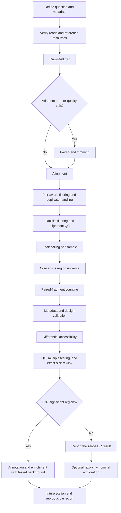

# Reusable bulk ATAC-seq tutorial

This tutorial translates the internship workflow into a reviewable sequence for
new **bulk, paired-end ATAC-seq** studies. It teaches the analytical logic and
validation gates; it is not a promise that one fixed command set is correct for
every organism, library preparation, or experimental design.

## Scope

The guide assumes biological replicates, paired-end reads, a suitable reference
genome, and a comparison that can be represented in a bulk count-based model.
It does not cover single-cell ATAC-seq, multiome assays, allele-specific
accessibility, or clinical-grade processing.

## Workflow map

## Inputs, outputs, and gates at a glance

| Stage | Starting input | Principal output | Continue only when |
|---|---|---|---|
| Metadata | Study design and file inventory | Ordered sample registry and declared contrast | identities, mates, replication, and model are coherent |
| Read QC | Paired FASTQ files | FastQC reports and focused MultiQC summary | file counts and important warnings are reviewed |
| Trimming | Raw paired FASTQ files | Paired trimmed FASTQ files | mate counts agree and post-trim QC is acceptable |
| Alignment | Validated reads and reference index | Alignment file and mapping log | reference identity and mapping summaries pass review |
| BAM processing | Alignments | Final coordinate-sorted BAM/BAI and QC metrics | structure, pairing, filters, and sample identity are valid |
| Peak calling | Final BAM for each sample | Per-sample peak sets | coordinates and cross-sample peak/QC patterns are plausible |
| Consensus/counting | Peak sets and final BAMs | Region-by-sample fragment-count matrix | features, count unit, matrix order, and assignment totals are valid |
| Differential analysis | Integer counts and ordered metadata | Effect estimates, adjusted p-values, diagnostics, and classification | design, contrast, thresholds, and output dimensions are validated |
| Downstream analysis | Declared target and tested background | Annotation or enrichment summaries | scope and language remain compatible with the primary evidence |

## Chapters

1. [Overview and decision points](00_overview.md)
2. [Requirements and project setup](01_requirements_and_project_setup.md)
3. [Samples, metadata, and statistical design](02_samples_and_metadata.md)
4. [Raw-read quality control](03_raw_read_quality_control.md)
5. [Adapter and quality trimming](04_adapter_trimming.md)
6. [Alignment](05_alignment.md)
7. [BAM filtering and alignment QC](06_bam_filtering_and_qc.md)
8. [Peak calling](07_peak_calling.md)
9. [Consensus peaks and fragment counting](08_consensus_peaks_and_counting.md)
10. [Differential accessibility](09_differential_accessibility.md)
11. [Annotation and enrichment](10_annotation_and_enrichment.md)
12. [Interpretation and reporting](11_interpretation_and_reporting.md)
13. [Troubleshooting and stop conditions](12_troubleshooting.md)

For a compact run plan, use [QUICKSTART.md](QUICKSTART.md). Blank metadata and
parameter files are provided under [`config/templates/`](../../config/templates/).

## Using the tutorial with an AI agent

The [`agent/`](../../agent/) directory converts the chapter sequence into a
machine-readable, human-supervised contract. It includes stage dependencies,
approval gates, status vocabulary, schemas, configuration validation, and an
example starting request. Agents must still stop for study-specific scientific
decisions and may execute only an explicitly approved stage.

## How this relates to the internship

The repository's main analysis is the worked example. Exact internship choices
are recorded in [`config/analysis_parameters.yaml`](../../config/analysis_parameters.yaml)
and [`docs/METHODS.md`](../METHODS.md). Commands in the tutorial are patterns
with placeholders. The scripts under [`workflow/`](../../workflow/) preserve
case-study-specific validation and should be adapted deliberately for a new
study rather than run unchanged.
